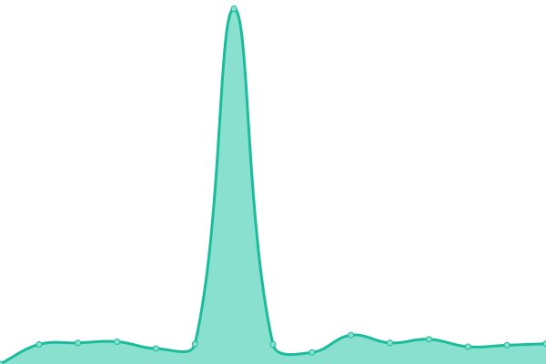

# [📈 Live Status](https://demo.upptime.js.org): <!--live status--> **🟧 Partial outage**

This repository contains the open-source uptime monitor and status page for [CHM, Inc.](https://chmorg.com), powered by [Upptime](https://github.com/upptime/upptime).

With [Upptime](https://upptime.js.org), you can get your own unlimited and free uptime monitor and status page, powered entirely by a GitHub repository. We use [Issues](https://github.com/chminc/status/issues) as incident reports, [Actions](https://github.com/chminc/status/actions) as uptime monitors, and [Pages](https://demo.upptime.js.org) for the status page.

<!--start: status pages-->
<!-- This summary is generated by Upptime (https://github.com/upptime/upptime) -->
<!-- Do not edit this manually, your changes will be overwritten -->
<!-- prettier-ignore -->
| URL | Status | History | Response Time | Uptime |
| --- | ------ | ------- | ------------- | ------ |
|  [Website](https://chminc.in) | 🟥 Down | [website.yml](https://github.com/chminc/status/commits/HEAD/history/website.yml) | 

 0ms
     
 | 

<a href="https://status.chminc.support/history/website">0.00%</a>
    

|  [cPortal](https://chminc.co.in) | 🟩 Up | [c-portal.yml](https://github.com/chminc/status/commits/HEAD/history/c-portal.yml) | 

 1900ms
     
 | 

<a href="https://status.chminc.support/history/c-portal">100.00%</a>
    

|  [DECP1](https://decp1.6dns.net) | 🟥 Down | [decp-1.yml](https://github.com/chminc/status/commits/HEAD/history/decp-1.yml) | 

 0ms
     
 | 

<a href="https://status.chminc.support/history/decp-1">0.00%</a>
    

|  [DEWI1](dewi1.6dns.net) | 🟩 Up | [dewi-1.yml](https://github.com/chminc/status/commits/HEAD/history/dewi-1.yml) | 

 129ms
     
 | 

<a href="https://status.chminc.support/history/dewi-1">100.00%</a>
    

|  [LUDA1](https://luda1.6dns.net) | 🟥 Down | [luda-1.yml](https://github.com/chminc/status/commits/HEAD/history/luda-1.yml) | 

 417ms
     
 | 

<a href="https://status.chminc.support/history/luda-1">100.00%</a>
    

|  [Cloud](https://cloud.6dns.net) | 🟩 Up | [cloud.yml](https://github.com/chminc/status/commits/HEAD/history/cloud.yml) | 

 982ms
     
 | 

<a href="https://status.chminc.support/history/cloud">100.00%</a>
    

<!--end: status pages-->

[**Visit our status website →**](https://demo.upptime.js.org)

## 📄 License

- Powered by: [Upptime](https://github.com/upptime/upptime)
- Code: [MIT](./LICENSE) © [CHM, Inc.](https://chmorg.com)
- Data in the `./history` directory: [Open Database License](https://opendatacommons.org/licenses/odbl/1-0/)
